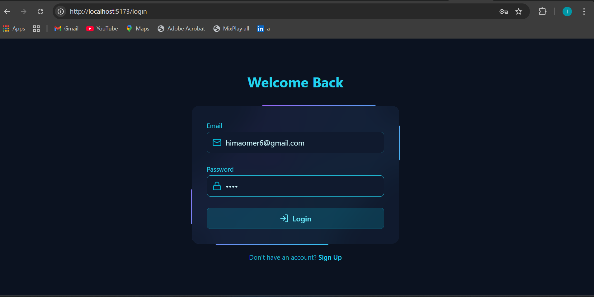
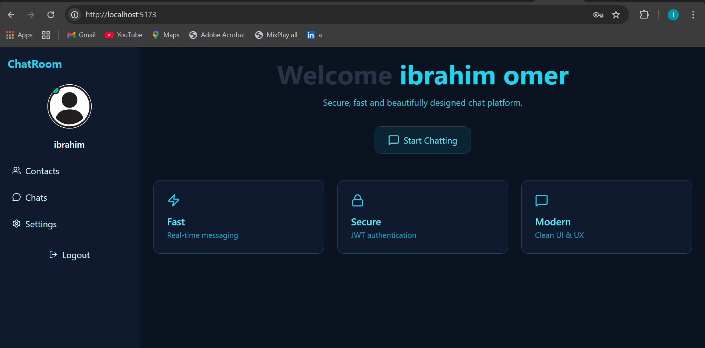
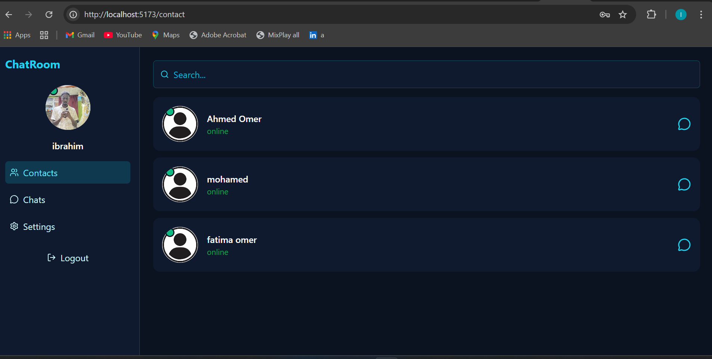
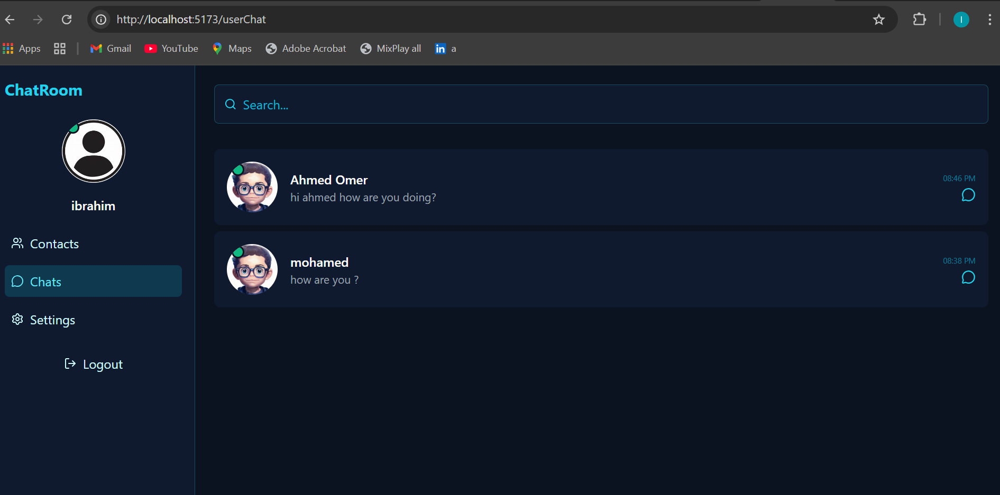
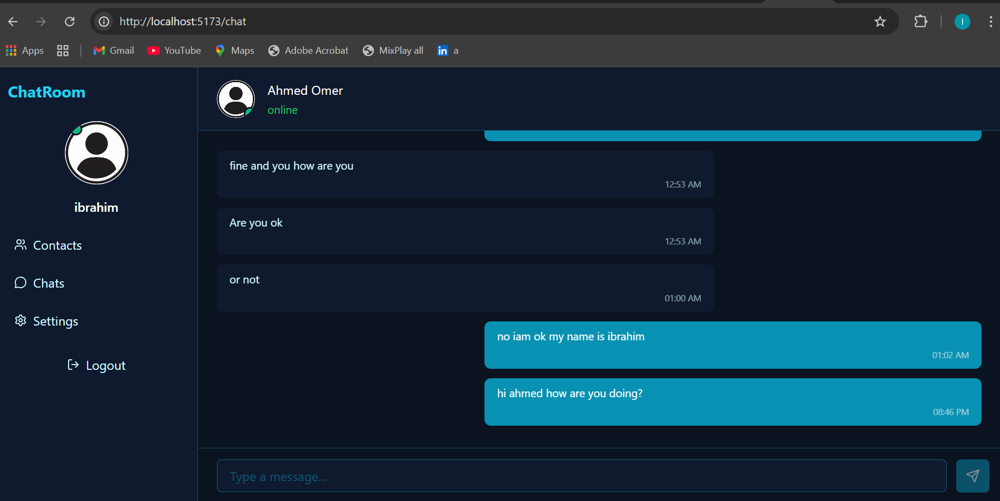

# Real-Time Chat Application 

A modern real-time chat application that allows users to communicate instantly with a clean, responsive, and secure interface.

## About
This project is a full-stack real-time chat application built using modern web technologies. It supports real-time messaging, secure user authentication, and a smooth user experience.

The app is designed to demonstrate:
- Real-time communication using Socket.IO
- Secure authentication with JWT and bcrypt
- Modern frontend development with React and Tailwind CSS
- Scalable backend architecture using Node.js and Express

## Features
- Real-time messaging with Socket.IO
- User authentication (Register / Login)
- Password hashing using bcrypt
- JWT-based authentication and authorization
- Responsive UI built with Tailwind CSS
- Online/offline user status
- Clean and modern chat interface

## Screenshots







## Tech Stack
### Frontend
- React
- Tailwind CSS
- JavaScript (ES6+)

### Backend
- Node.js
- Express.js
- Socket.IO
- JWT (JSON Web Tokens)
- bcrypt

## Getting Started

### Prerequisites
- Node.js (v16 or higher)
- npm or yarn

### Installation
1. Clone the repository:
   ```bash
   git clone https://github.com/ibrahimsome20/chat-app.git
   frontend
   npm run dev
   backend
   npm run dev